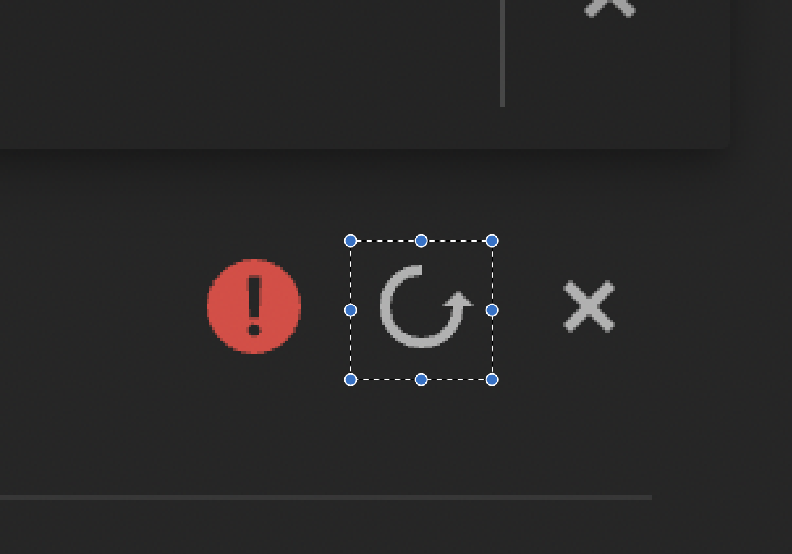
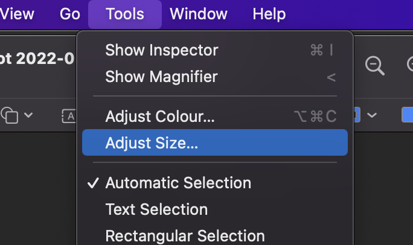
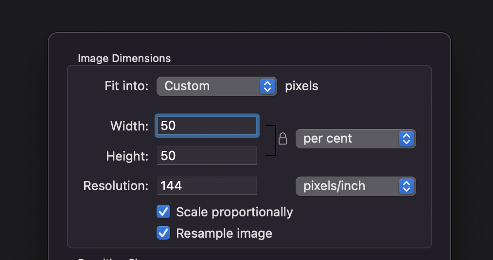

# FixNA2Download

## 1 Create the Automation

- Create a Screenshot of NA2's Download Error ( `cmd+shift+4` )

- Separate the `Refresh` button ( `cmd++` to Zoom in; `cmd+k` to Crop the selection )

- Change the size to `50` percent ( This step is mandatory on a Mac with Retina Display otherwise Robot Framework can not recognize the Image on the Screen )

- Create a new file `HandleRefreshButton.robot`