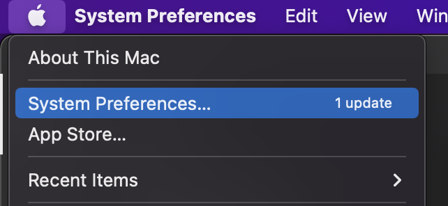
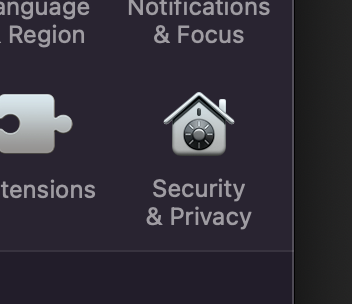
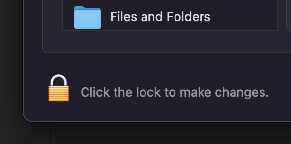
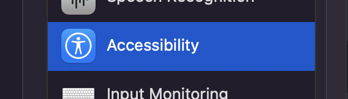
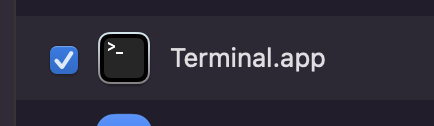

# FixNA2Download

## 1 Create the Automation

- Create a Screenshot of NA2's Download Error ( `cmd+shift+4` )


- Separate the `Refresh` button ( `cmd++` to Zoom in; `cmd+k` to Crop the selection )


- Change the size to `50` percent ( This step is mandatory on a Mac with Retina Display otherwise Robot Framework can not recognize the Image on the Screen )


- Save Image to `assets/images/RefreshButton.png`


- Create a new file `HandleRefreshButton.robot`

``` robot
*** Settings ***
Library  SikuliLibrary

Suite Setup  Add Image Path  assets/images
Suite Teardown  Stop Remote Server

*** Test Cases ***
Handle Refresh Button
  Handle Refresh Button

*** Keywords ***
Handle Refresh Button
  Mouse Move  RefreshButton
```

- Install Robot Framework via `pip install robotframework`

- Install Sikuli Library via `pip install robotframework-SikuliLibrary`

- Enable Accessibility for the Terminal at **System Preferences** / **Security & Privacy** / **Accessibility** / **Terminal.app**











- Create a folder `results`

- Run the `.robot` script via `robot -d results HandleRefreshButton.robot`

```
dirk.schiller@MNA801 main % robot -d results HandleRefreshButton.robot
==============================================================================
HandleRefreshButton                                                           
==============================================================================
Handle Refresh Button                                                 | PASS |
------------------------------------------------------------------------------
HandleRefreshButton                                                   | PASS |
1 test, 1 passed, 0 failed
==============================================================================
Output:  /Volumes/Samsg 500GB/Work/Coding/Robot/FixNA2Download/main/results/output.xml
Log:     /Volumes/Samsg 500GB/Work/Coding/Robot/FixNA2Download/main/results/log.html
Report:  /Volumes/Samsg 500GB/Work/Coding/Robot/FixNA2Download/main/results/report.html
```